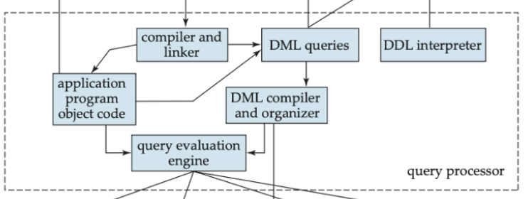
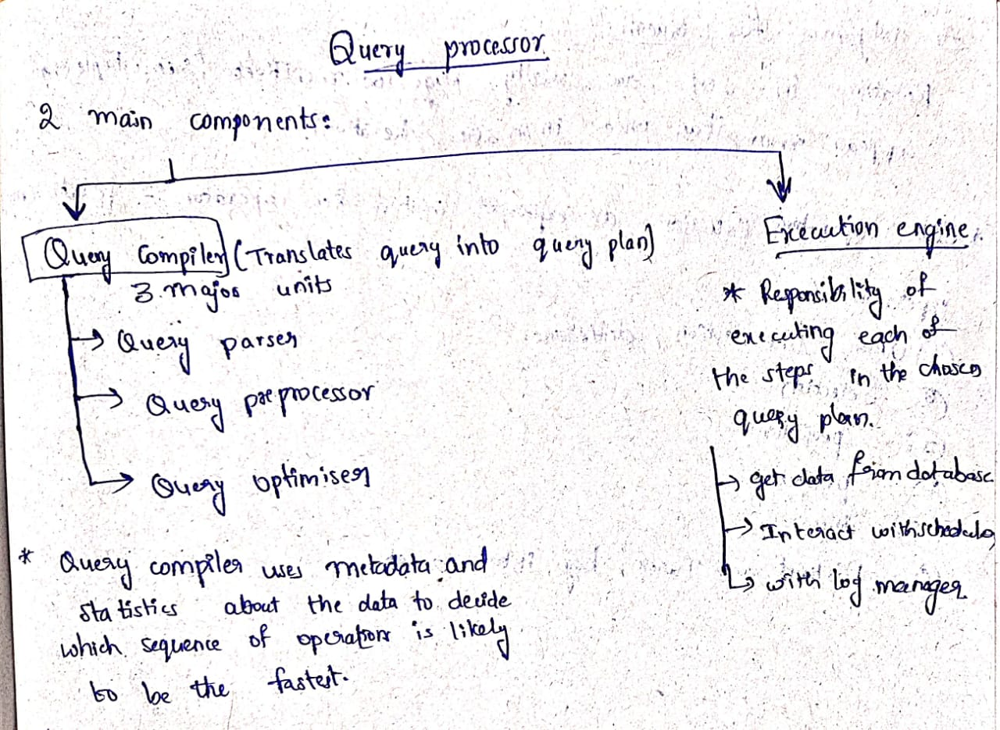
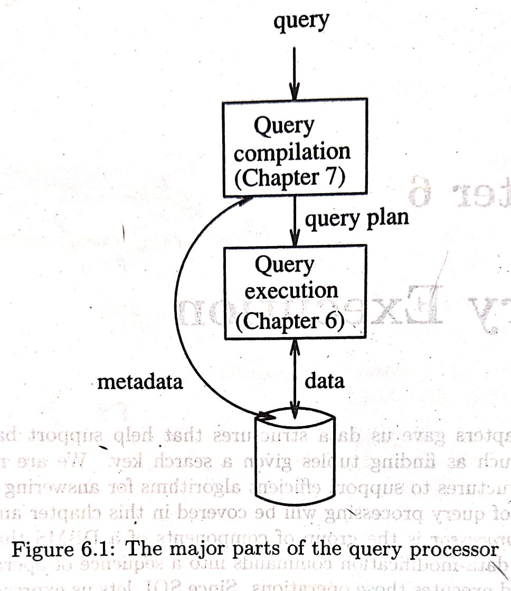
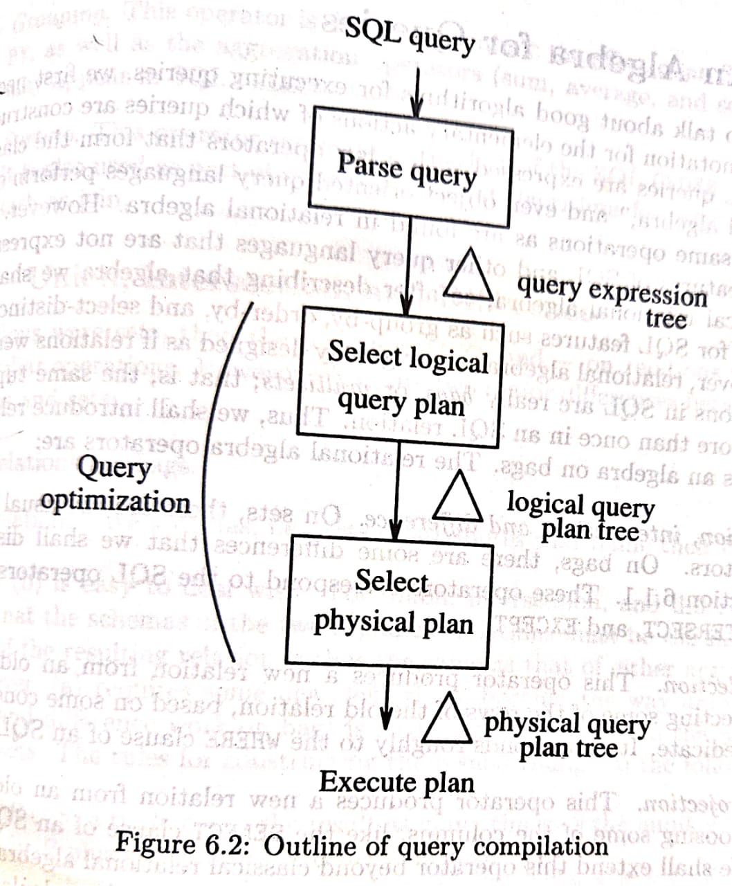
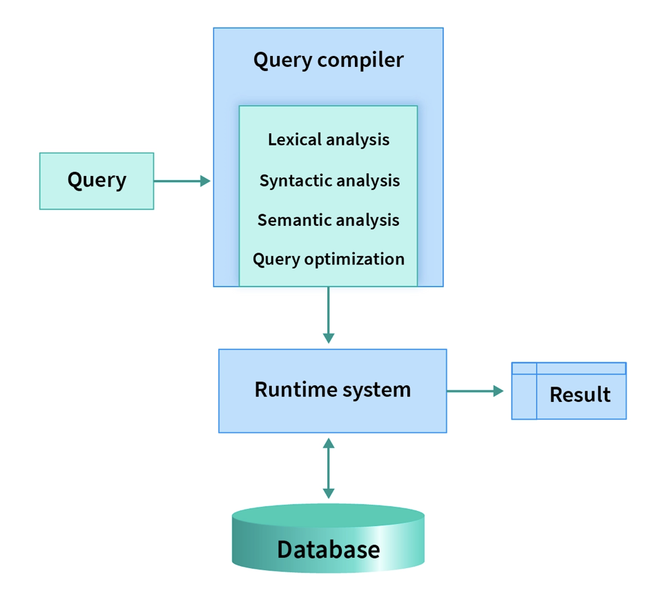
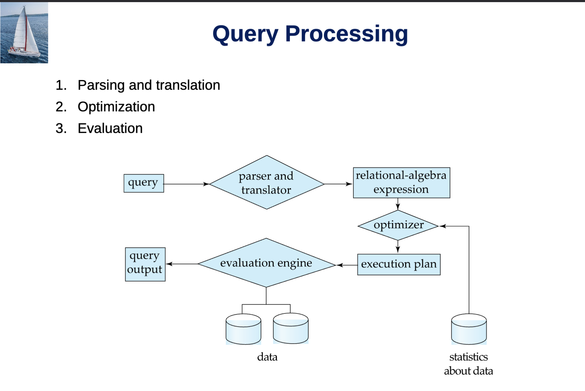
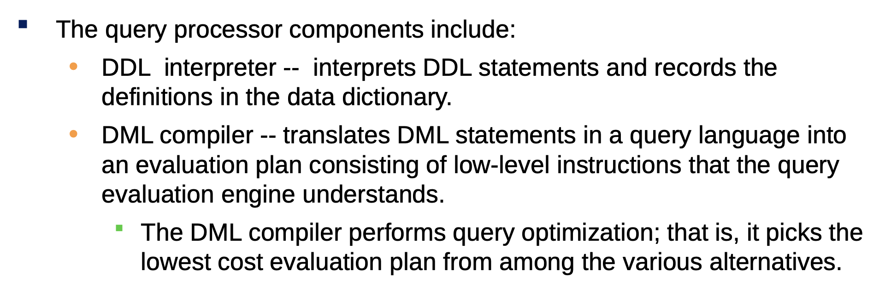
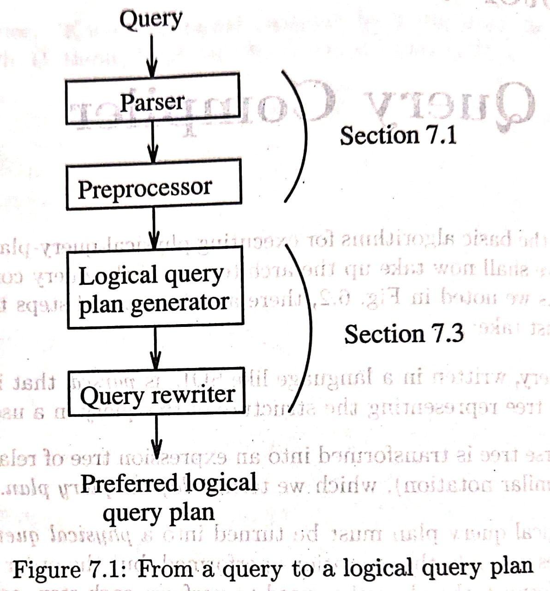
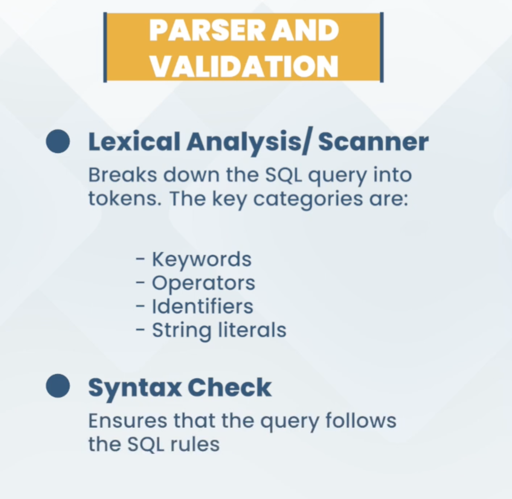

# Query Processor

* To implement Query processor with initial goals of implementing **Query Compiler** that contains **Query Parser:** Syntactic Parsing and Semantic Parsing.

### Query Processor
* In Between User Applications and Storage Manager of RDBMS.

---

---

---
<table>
  <tr>
    <td>
      
    </td>
    <td>
      
      
<em>Query Parser output is Query Expression Tree.</em>

    </td>
  </tr>
</table>

---

* Query Compiler:
    - Lexical Analysis
    - Syntactic Analysis
    - Semantic Analysis
    - Query Optimization

---

---

* DDL Interpreter doesn't require Query Optimisation
---

## Parser
* The job of the parser is to take text written in a language such as SQL and convert into a **Parse Tree.**

### Parse Tree
* Tree whose nodes correspond to either:
    - Atoms: lexical elements such as keywords, names of attributes or relations, constants, parentheses, operators such as + or <, and other schema elements
    - Syntactic Categories: names for families of query subparts that all play a similar role in the query.

---

---

